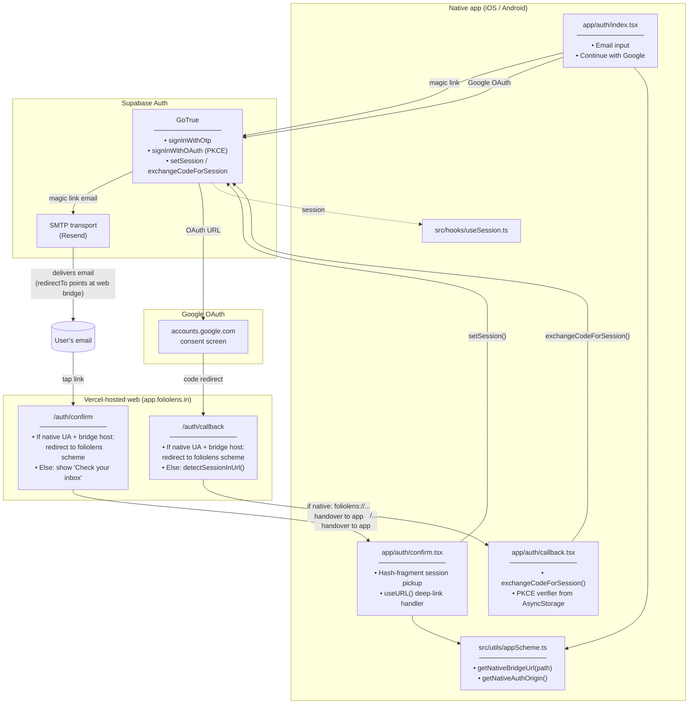
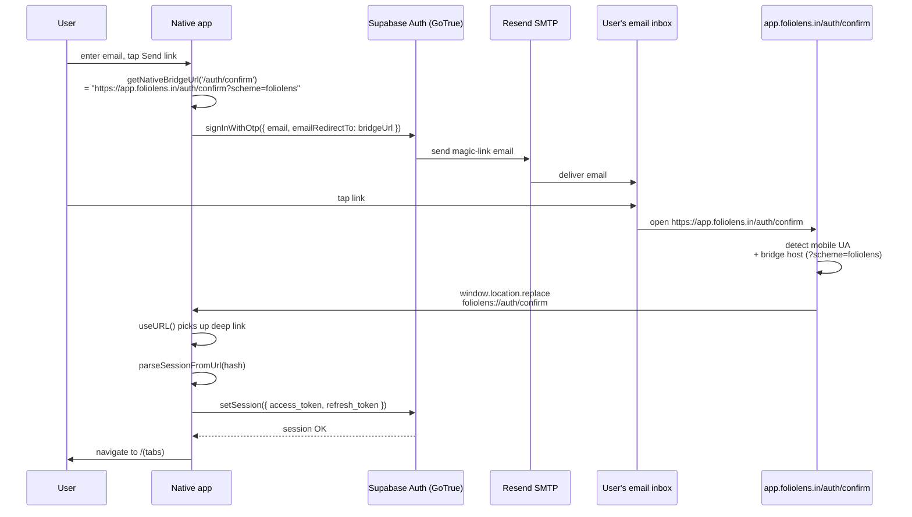
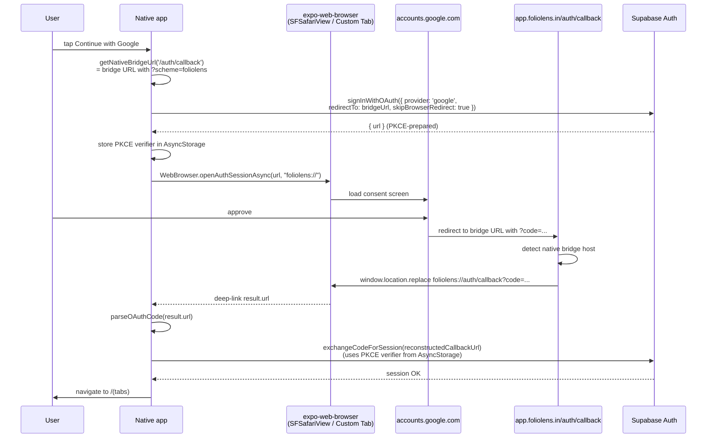

# Auth Flow — Magic Link + Google OAuth (web + native bridge)

Two providers (magic-link via Supabase + Resend SMTP, and Google OAuth) × two surfaces (web + native), so four code paths. The "native bridge" is what makes magic-link emails and OAuth callbacks work in a native app where the email client and the system browser don't know about a deep-link scheme.

## Where things live

## Magic-link sequence (native)

## Google OAuth sequence (native)

## Why the web bridge

Native apps can't put `foliolens://` into a magic-link `redirectTo` because:

- **Email clients refuse non-https URLs.** Some clients render `foliolens://` as plain text and don't make it tappable.
- **Google OAuth's `redirect_uri` whitelist requires https** for production OAuth clients. Custom URI schemes are allowed for "installed app" flows but the consent screen UX is worse and FolioLens is one shared Google project across web + native.

So both flows use `https://app.foliolens.in/auth/{confirm,callback}` as the public landing page. The web app at that path detects `?scheme=foliolens` (added by `getNativeBridgeUrl`) plus the running platform's hostname, and `window.location.replace`s into the deep-link scheme so the native app picks it up via `Linking.useURL()`.

On a desktop browser without `?scheme=foliolens`, the same web pages serve regular auth UI (the magic-link "check your inbox" screen, or `detectSessionInUrl()` + redirect to home).

## Roles per env-var

| Env var | Where | Role |
|---|---|---|
| `EXPO_PUBLIC_SUPABASE_URL` | Client (build-time) | GoTrue endpoint |
| `EXPO_PUBLIC_SUPABASE_PUBLISHABLE_KEY` | Client (build-time) | Anon API key |
| `EXPO_PUBLIC_APP_BASE_URL` | Client (build-time) | Bridge host — `https://app.foliolens.in` (prod) or `https://foliolens-dev.vercel.app` (dev) |
| `EXPO_PUBLIC_APP_SCHEME` | Client (build-time) | Defaults to `foliolens`; native deep-link scheme |
| (Supabase Dashboard) | Auth → Providers → Google | Google OAuth client id + secret per project |
| (Supabase Dashboard) | Auth → URL Configuration | Allowed redirect URLs include `foliolens://**` and the web bridge |
| (Resend Dashboard) | Domains → `foliolens.in` | DKIM/SPF/DMARC verified for the magic-link sender |
