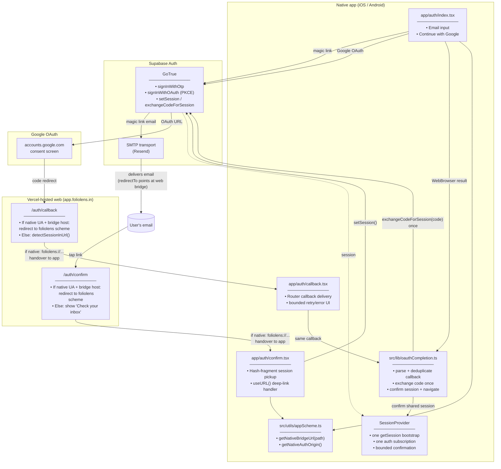
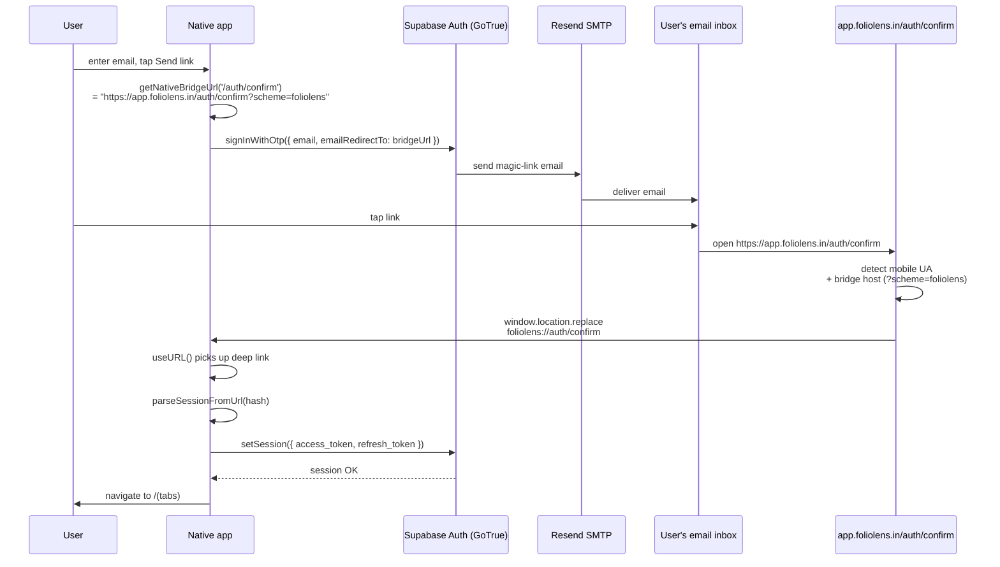

# Auth Flow — Magic Link + Google OAuth (web + native bridge)

Two providers (magic-link via Supabase + Resend SMTP, and Google OAuth) × two surfaces (web + native), so four code paths. The "native bridge" is what makes magic-link emails and OAuth callbacks work in a native app where the email client and the system browser don't know about a deep-link scheme.

## Where things live

```mermaid
graph TB
  subgraph Mobile["Native app (iOS / Android)"]
    auth_screen["app/auth/index.tsx<br/>──────────────<br/>• Email input<br/>• Continue with Google"]
    confirm_screen["app/auth/confirm.tsx<br/>──────────────<br/>• Hash-fragment session pickup<br/>• useURL() deep-link handler"]
    callback_screen["app/auth/callback.tsx<br/>──────────────<br/>• Router callback delivery<br/>• bounded retry/error UI"]
    coordinator["src/lib/oauthCompletion.ts<br/>──────────────<br/>• parse + deduplicate callback<br/>• exchange code once<br/>• confirm session + navigate"]
    scheme_util["src/utils/appScheme.ts<br/>──────────────<br/>• getNativeBridgeUrl(path)<br/>• getNativeAuthOrigin()"]
    session_provider["SessionProvider<br/>──────────────<br/>• one getSession bootstrap<br/>• one auth subscription<br/>• bounded confirmation"]
  end

  subgraph WebShim["Vercel-hosted web (app.foliolens.in)"]
    web_confirm["/auth/confirm<br/>──────────────<br/>• If native UA + bridge host:<br/>  redirect to foliolens scheme<br/>• Else: show 'Check your inbox'"]
    web_callback["/auth/callback<br/>──────────────<br/>• If native UA + bridge host:<br/>  redirect to foliolens scheme<br/>• Else: detectSessionInUrl()"]
  end

  subgraph Supabase["Supabase Auth"]
    auth["GoTrue<br/>──────────────<br/>• signInWithOtp<br/>• signInWithOAuth (PKCE)<br/>• setSession / exchangeCodeForSession"]
    smtp["SMTP transport<br/>(Resend)"]
  end

  subgraph Google["Google OAuth"]
    consent["accounts.google.com<br/>consent screen"]
  end

  auth_screen -- "magic link" --> auth
  auth_screen -- "Google OAuth" --> auth
  auth -- "magic link email" --> smtp
  smtp -- "delivers email<br/>(redirectTo points at web bridge)" --> user[("User's email")]
  user -- "tap link" --> web_confirm
  web_confirm -- "if native: foliolens://...<br/>handover to app" --> confirm_screen
  confirm_screen -- "setSession()" --> auth

  auth -- "OAuth URL" --> consent
  consent -- "code redirect" --> web_callback
  web_callback -- "if native: foliolens://...<br/>handover to app" --> callback_screen
  auth_screen -- "WebBrowser result" --> coordinator
  callback_screen -- "same callback" --> coordinator
  coordinator -- "exchangeCodeForSession(code) once" --> auth
  coordinator -- "confirm shared session" --> session_provider

  auth_screen --> scheme_util
  confirm_screen --> scheme_util
  auth -.session.-> session_provider
```

## Magic-link sequence (native)

```mermaid
sequenceDiagram
  participant U as User
  participant App as Native app
  participant Auth as Supabase Auth (GoTrue)
  participant Resend as Resend SMTP
  participant Inbox as User's email inbox
  participant Web as app.foliolens.in/auth/confirm

  U->>App: enter email, tap Send link
  App->>App: getNativeBridgeUrl('/auth/confirm')<br/>= "https://app.foliolens.in/auth/confirm?scheme=foliolens"
  App->>Auth: signInWithOtp({ email, emailRedirectTo: bridgeUrl })
  Auth->>Resend: send magic-link email
  Resend->>Inbox: deliver email
  U->>Inbox: tap link
  Inbox->>Web: open https://app.foliolens.in/auth/confirm#access_token=...&refresh_token=...

  Web->>Web: detect mobile UA<br/>+ bridge host (?scheme=foliolens)
  Web->>App: window.location.replace<br/>foliolens://auth/confirm#access_token=...
  App->>App: useURL() picks up deep link
  App->>App: parseSessionFromUrl(hash)
  App->>Auth: setSession({ access_token, refresh_token })
  Auth-->>App: session OK
  App->>U: navigate to /(tabs)
```

## Google OAuth sequence (native)

```mermaid
sequenceDiagram
  participant U as User
  participant App as Native app
  participant Browser as expo-web-browser<br/>(SFSafariView / Custom Tab)
  participant Google as accounts.google.com
  participant Web as app.foliolens.in/auth/callback
  participant Auth as Supabase Auth
  participant Coordinator as OAuth completion coordinator
  participant Session as SessionProvider

  U->>App: tap Continue with Google
  App->>App: getNativeBridgeUrl('/auth/callback')<br/>= bridge URL with ?scheme=foliolens
  App->>Auth: signInWithOAuth({ provider: 'google',<br/>redirectTo: bridgeUrl, skipBrowserRedirect: true })
  Auth-->>App: { url } (PKCE-prepared)
  App->>App: store PKCE verifier in AsyncStorage
  App->>Browser: WebBrowser.openAuthSessionAsync(url, "foliolens://")
  Browser->>Google: load consent screen
  U->>Google: approve
  Google->>Web: redirect to bridge URL with ?code=...
  Web->>Web: detect native bridge host
  Web->>Browser: window.location.replace foliolens://auth/callback?code=...
  Browser-->>App: deep-link result.url
  App->>Coordinator: WebBrowser result and/or Router callback
  Coordinator->>Coordinator: hash callback in memory; deduplicate delivery
  Coordinator->>Auth: exchangeCodeForSession(code)<br/>(uses PKCE verifier from AsyncStorage)
  Auth-->>Session: one SIGNED_IN event
  Coordinator->>Session: wait for exact returned session
  alt event was missed
    Coordinator->>Auth: getSession() once for reconciliation
    Auth-->>Session: apply reconciled session
    Session->>Session: publish effective SIGNED_IN once<br/>and suppress one delayed identical provider event
  end
  Coordinator->>App: replace /(tabs) once
  App->>U: portfolio opens
```

`src/lib/supabase.ts` sets `flowType: 'pkce'`; this is not left to the SDK default. The new path passes only the returned authorization code to `exchangeCodeForSession`. OAuth fragments containing access and refresh tokens are rejected: unlike the code path, they have no PKCE-verifier proof, and accepting them from a custom-scheme URL would permit login-CSRF session swapping. Magic-link fragments remain owned by the separate `/auth/confirm` route.

Both `openAuthSessionAsync` and Expo Router can observe the same native deep link. They call the same process-wide coordinator, whose in-flight/completed map guarantees one exchange and one navigation. The Router fallback accepts a `Linking.useURL()` value only when its scheme matches the installed build and its route is exactly `/auth/callback`; stale `/auth/confirm` links wait for the real Router parameters instead of entering OAuth completion. URL creation, browser return, exchange, shared-session confirmation, one reconciliation attempt, and navigation are bounded. Cancellation, dismissal, and failures clear the initiating loading state and return actionable UI; no callback screen can spin forever.

`maybeCompleteAuthSession()` runs only on web, where Expo uses it to close an OAuth popup. Expo's native implementation does not use that method; Android completion is owned by the WebBrowser AppState/Linking polyfill and the shared coordinator.

The coordinator emits `oauth_started`, `browser_returned`, `callback_received`, `session_started`, `session_confirmed`, and `navigation_completed` to analytics and a matching `[auth/oauth]` release log line for device evidence. Properties are restricted to duration, platform, app/update/channel identifiers, browser result type, callback transport/source, intent, and a non-secret flow ID. Callback URLs, codes, tokens, email addresses, and provider identities are never logged or tracked; tests inspect both analytics calls and console payloads for those forbidden values.

## Why the web bridge

Native apps can't put `foliolens://` into a magic-link `redirectTo` because:

- **Email clients refuse non-https URLs.** Some clients render `foliolens://` as plain text and don't make it tappable.
- **Google OAuth's `redirect_uri` whitelist requires https** for production OAuth clients. Custom URI schemes are allowed for "installed app" flows but the consent screen UX is worse and FolioLens is one shared Google project across web + native.

So both flows use `https://app.foliolens.in/auth/{confirm,callback}` as the public landing page. The web app at that path detects `?scheme=foliolens` (added by `getNativeBridgeUrl`) plus the running platform's hostname, and `window.location.replace`s into the deep-link scheme so the native app picks it up via `Linking.useURL()`.

On a desktop browser without `?scheme=foliolens`, the same web pages serve regular auth UI (the magic-link "check your inbox" screen, or `detectSessionInUrl()` + redirect to home).

## Roles per env-var

| Env var | Where | Role |
|---|---|---|
| `EXPO_PUBLIC_SUPABASE_URL` | Client (build-time) | GoTrue endpoint |
| `EXPO_PUBLIC_SUPABASE_PUBLISHABLE_KEY` | Client (build-time) | Anon API key |
| `EXPO_PUBLIC_APP_BASE_URL` | Client (build-time) | Bridge host — `https://app.foliolens.in` (prod) or `https://foliolens-dev.vercel.app` (dev) |
| `EXPO_PUBLIC_APP_SCHEME` | Client (build-time) | Native deep-link scheme (`foliolens`, `foliolens-main`, or `foliolens-pr`) |
| (Supabase Dashboard) | Auth → Providers → Google | Google OAuth client id + secret per project |
| (Supabase Dashboard) | Auth → URL Configuration | Allowed redirect URLs include `foliolens://**` and the web bridge |
| (Resend Dashboard) | Domains → `foliolens.in` | DKIM/SPF/DMARC verified for the magic-link sender |
