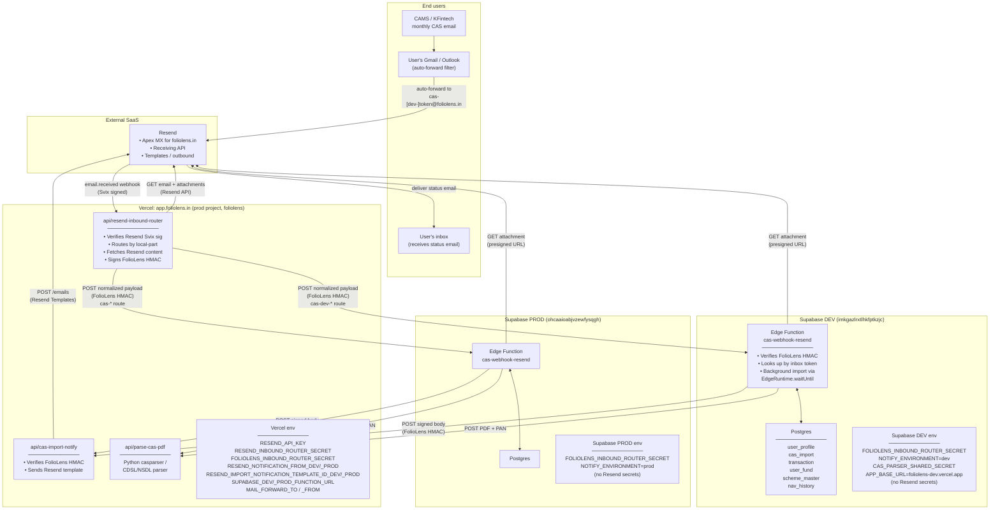
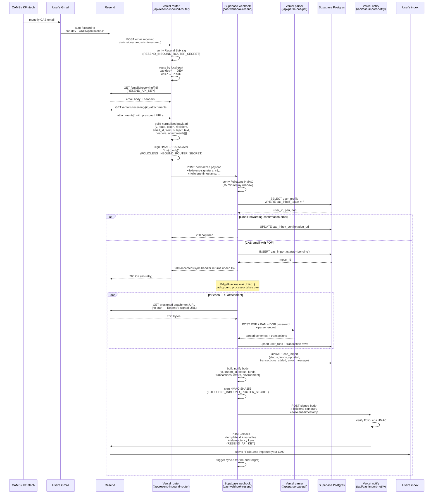

# CAS Inbound Flow Architecture

After Issue #107 (PR #111), Resend operational knowledge lives only at the Vercel router. Supabase processes a router-normalized, FolioLens-signed payload and never talks to Resend directly.

## Where things live

## Data flow for a single inbound CAS

## Why this shape

1. **One Resend boundary.** Vercel is the only component with `RESEND_API_KEY` or knowledge of Resend's Svix protocol. Rotating Resend secrets touches one project, not three.
2. **Supabase signature is FolioLens-owned.** The HMAC over `<unix-ts>.<body>` is symmetric: the same secret signs the inbound handoff (router → Supabase) and the outbound notification callback (Supabase → notify endpoint). Five-minute replay window matches Svix's tolerance.
3. **Attachment fetch by Supabase is unauthenticated.** Resend's `download_url` is a presigned URL that's valid for a short window — Supabase fetches PDF bytes directly without needing a Resend API key. Signed URLs are part of the normalized payload, so they're covered by the FolioLens HMAC.
4. **Sync handler returns in <1 s.** Audit row + background hand-off finishes well inside the Svix 15-second timeout, so Resend never retries a successful import.
5. **Background catch-all guarantees feedback.** Any unhandled throw in the background processor promotes the `pending` row to `failed` with the error message and emails the user via the same notify endpoint. No silent stuck rows.
6. **DEV vs PROD separation by local-part.** A single Resend account + apex MX serves both environments. `cas-dev-<token>@foliolens.in` routes to DEV Supabase, `cas-<token>@foliolens.in` to PROD. The router decides; both Supabase projects share the same `FOLIOLENS_INBOUND_ROUTER_SECRET` and HMAC verification logic.

## Diagnostic answers per the issue

| Question | Where to look |
|---|---|
| Did Resend deliver the webhook? | Resend dashboard → Webhooks log |
| Which route did the router choose? | Vercel function log: `{ok: true, route: "cas_dev"\|"cas_prod"\|"human_forward"\|"drop"}` |
| Did Supabase receive the normalized payload? | Vercel router log: HTTP status from `forward_cas_to_supabase`. Supabase function log: HTTP boundary entry. |
| Was the inbox token unknown / missing PAN / etc.? | Supabase function log: `[cas-webhook-resend] DROPPED <reason>: token=…, recipient=…, email_id=…` (stable grep tag) |
| Did the import succeed/fail and why? | `cas_import` row's `import_status` + `error_message` (authoritative); plus `[cas-webhook-resend] background_completed` log line |
| Did the user get a notification email? | `[cas-webhook-resend] notification sent` (success) or `DROPPED notification_failed: import_id=…, status=…, error=…` (failure). Resend dashboard for delivery status. |
