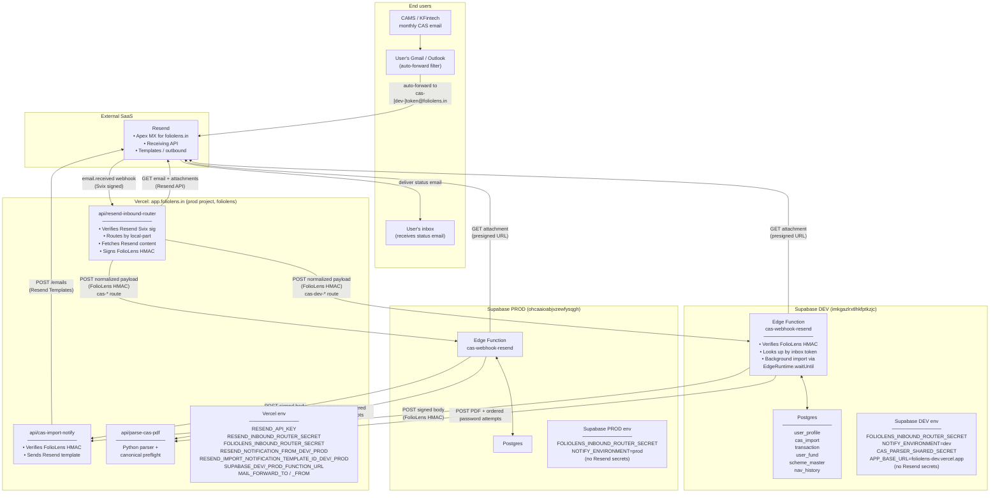
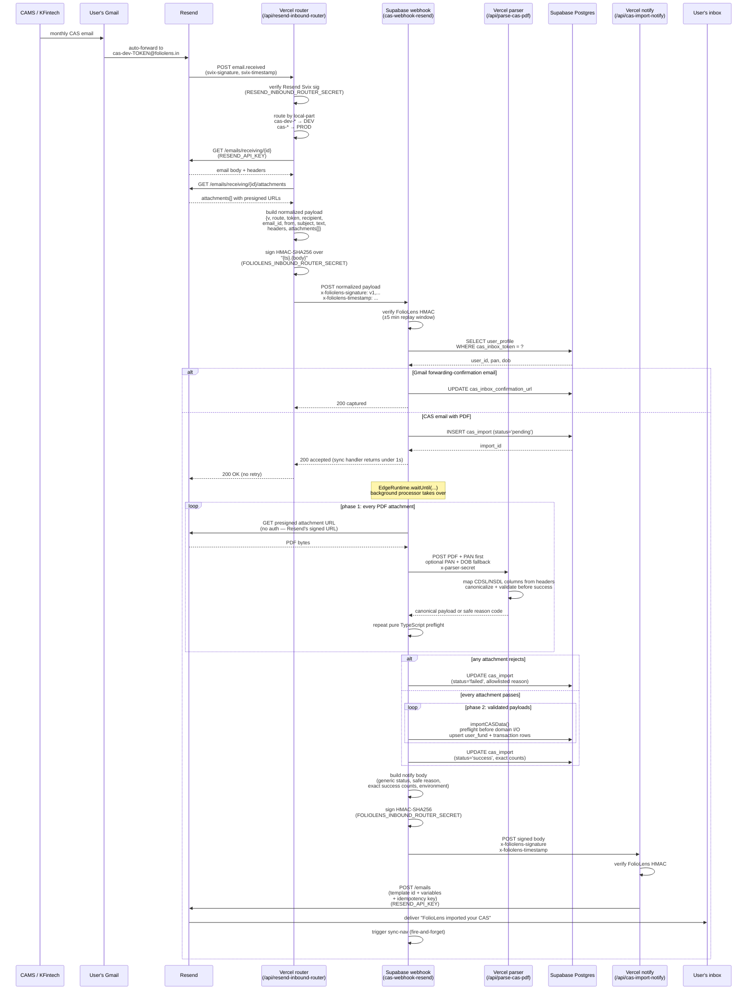

# CAS Inbound Flow Architecture

After Issue #107 (PR #111), Resend operational knowledge lives only at the Vercel router. Supabase processes a router-normalized, FolioLens-signed payload and never talks to Resend directly.

## Where things live

```mermaid
graph TB
  subgraph Users["End users"]
    cams[CAMS / KFintech<br/>monthly CAS email]
    gmail["User's Gmail / Outlook<br/>(auto-forward filter)"]
    inbox["User's inbox<br/>(receives status email)"]
  end

  subgraph External["External SaaS"]
    resend["Resend<br/>• Apex MX for foliolens.in<br/>• Receiving API<br/>• Templates / outbound"]
  end

  subgraph Vercel["Vercel: app.foliolens.in (prod project, foliolens)"]
    router["api/resend-inbound-router<br/>──────────────<br/>• Verifies Resend Svix sig<br/>• Routes by local-part<br/>• Fetches Resend content<br/>• Signs FolioLens HMAC"]
    notify["api/cas-import-notify<br/>──────────────<br/>• Verifies FolioLens HMAC<br/>• Sends Resend template"]
    parser["api/parse-cas-pdf<br/>──────────────<br/>Python parser +<br/>canonical preflight"]
    secrets_v["Vercel env<br/>──────────────<br/>RESEND_API_KEY<br/>RESEND_INBOUND_ROUTER_SECRET<br/>FOLIOLENS_INBOUND_ROUTER_SECRET<br/>RESEND_NOTIFICATION_FROM_DEV/_PROD<br/>RESEND_IMPORT_NOTIFICATION_TEMPLATE_ID_DEV/_PROD<br/>SUPABASE_DEV/_PROD_FUNCTION_URL<br/>MAIL_FORWARD_TO / _FROM"]
  end

  subgraph SupabaseDev["Supabase DEV (imkgazlrxtlhkfptkzjc)"]
    edge_d["Edge Function<br/>cas-webhook-resend<br/>──────────────<br/>• Verifies FolioLens HMAC<br/>• Looks up by inbox token<br/>• Background import via<br/>  EdgeRuntime.waitUntil"]
    db_d["Postgres<br/>──────────────<br/>user_profile<br/>cas_import<br/>transaction<br/>user_fund<br/>scheme_master<br/>nav_history"]
    secrets_d["Supabase DEV env<br/>──────────────<br/>FOLIOLENS_INBOUND_ROUTER_SECRET<br/>NOTIFY_ENVIRONMENT=dev<br/>CAS_PARSER_SHARED_SECRET<br/>APP_BASE_URL=foliolens-dev.vercel.app<br/>(no Resend secrets)"]
  end

  subgraph SupabaseProd["Supabase PROD (ohcaaioabjvzewfysqgh)"]
    edge_p["Edge Function<br/>cas-webhook-resend"]
    db_p["Postgres"]
    secrets_p["Supabase PROD env<br/>──────────────<br/>FOLIOLENS_INBOUND_ROUTER_SECRET<br/>NOTIFY_ENVIRONMENT=prod<br/>(no Resend secrets)"]
  end

  cams --> gmail
  gmail -- "auto-forward to<br/>cas-[dev-]token@foliolens.in" --> resend
  resend -- "email.received webhook<br/>(Svix signed)" --> router
  router -- "GET email + attachments<br/>(Resend API)" --> resend
  router -- "POST normalized payload<br/>(FolioLens HMAC)<br/>cas-dev-* route" --> edge_d
  router -- "POST normalized payload<br/>(FolioLens HMAC)<br/>cas-* route" --> edge_p
  edge_d -- "GET attachment<br/>(presigned URL)" --> resend
  edge_p -- "GET attachment<br/>(presigned URL)" --> resend
  edge_d -- "POST PDF + ordered password attempts" --> parser
  edge_p -- "POST PDF + ordered password attempts" --> parser
  edge_d <--> db_d
  edge_p <--> db_p
  edge_d -- "POST signed body<br/>(FolioLens HMAC)" --> notify
  edge_p -- "POST signed body<br/>(FolioLens HMAC)" --> notify
  notify -- "POST /emails<br/>(Resend Templates)" --> resend
  resend -- "deliver status email" --> inbox
```

## Data flow for a single inbound CAS

```mermaid
sequenceDiagram
  participant CAMS as CAMS / KFintech
  participant GM as User's Gmail
  participant RS as Resend
  participant R as Vercel router<br/>(/api/resend-inbound-router)
  participant SB as Supabase webhook<br/>(cas-webhook-resend)
  participant P as Vercel parser<br/>(/api/parse-cas-pdf)
  participant DB as Supabase Postgres
  participant N as Vercel notify<br/>(/api/cas-import-notify)
  participant U as User's inbox

  CAMS->>GM: monthly CAS email
  GM->>RS: auto-forward to<br/>cas-dev-TOKEN@foliolens.in
  RS->>R: POST email.received<br/>(svix-signature, svix-timestamp)
  R->>R: verify Resend Svix sig<br/>(RESEND_INBOUND_ROUTER_SECRET)
  R->>R: route by local-part<br/>cas-dev-* → DEV<br/>cas-* → PROD
  R->>RS: GET /emails/receiving/{id}<br/>(RESEND_API_KEY)
  RS-->>R: email body + headers
  R->>RS: GET /emails/receiving/{id}/attachments
  RS-->>R: attachments[] with presigned URLs

  R->>R: build normalized payload<br/>{v, route, token, recipient,<br/> email_id, from, subject, text,<br/> headers, attachments[]}
  R->>R: sign HMAC-SHA256 over<br/>"{ts}.{body}"<br/>(FOLIOLENS_INBOUND_ROUTER_SECRET)
  R->>SB: POST normalized payload<br/>x-foliolens-signature: v1,...<br/>x-foliolens-timestamp: ...

  SB->>SB: verify FolioLens HMAC<br/>(±5 min replay window)
  SB->>DB: SELECT user_profile<br/>WHERE cas_inbox_token = ?
  DB-->>SB: user_id, pan, dob

  alt Gmail forwarding-confirmation email
    SB->>DB: UPDATE cas_inbox_confirmation_url
    SB-->>R: 200 captured
  else CAS email with PDF
    SB->>DB: INSERT cas_import (status='pending')
    DB-->>SB: import_id
    SB-->>R: 200 accepted (sync handler returns under 1s)
    R-->>RS: 200 OK (no retry)

    Note over SB: EdgeRuntime.waitUntil(...)<br/>background processor takes over

    loop phase 1: every PDF attachment
      SB->>RS: GET presigned attachment URL<br/>(no auth — Resend's signed URL)
      RS-->>SB: PDF bytes
      SB->>P: POST PDF + PAN first<br/>optional PAN + DOB fallback<br/>x-parser-secret
      P->>P: map CDSL/NSDL columns from headers<br/>canonicalize + validate before success
      P-->>SB: canonical payload or safe reason code
      SB->>SB: repeat pure TypeScript preflight
    end

    alt any attachment rejects
      SB->>DB: UPDATE cas_import<br/>(status='failed', allowlisted reason)
    else every attachment passes
      loop phase 2: validated payloads
        SB->>DB: importCASData()<br/>preflight before domain I/O<br/>upsert user_fund + transaction rows
      end
      SB->>DB: UPDATE cas_import<br/>(status='success', exact counts)
    end

    SB->>SB: build notify body<br/>(generic status, safe reason,<br/>exact success counts, environment)
    SB->>SB: sign HMAC-SHA256<br/>(FOLIOLENS_INBOUND_ROUTER_SECRET)
    SB->>N: POST signed body<br/>x-foliolens-signature<br/>x-foliolens-timestamp
    N->>N: verify FolioLens HMAC
    N->>RS: POST /emails<br/>(template id + variables<br/>+ idempotency key)<br/>(RESEND_API_KEY)
    RS->>U: deliver "FolioLens imported your CAS"

    SB->>SB: trigger sync-nav (fire-and-forget)
  end
```

## Why this shape

1. **One Resend boundary.** Vercel is the only component with `RESEND_API_KEY` or knowledge of Resend's Svix protocol. Rotating Resend secrets touches one project, not three.
2. **Supabase signature is FolioLens-owned.** The HMAC over `<unix-ts>.<body>` is symmetric: the same secret signs the inbound handoff (router → Supabase) and the outbound notification callback (Supabase → notify endpoint). Five-minute replay window matches Svix's tolerance.
3. **Attachment fetch by Supabase is unauthenticated.** Resend's `download_url` is a presigned URL that's valid for a short window — Supabase fetches PDF bytes directly without needing a Resend API key. Signed URLs are part of the normalized payload, so they're covered by the FolioLens HMAC.
4. **Sync handler returns in <1 s.** Audit row + background hand-off finishes well inside the Svix 15-second timeout, so Resend never retries a successful import.
5. **Background catch-all guarantees privacy-safe feedback.** Any unhandled throw promotes the `pending` row to `failed` with an allowlisted reason code and emails a generic actionable message through the same notify endpoint. Raw exceptions and normalized webhook payloads are neither persisted nor emitted.
6. **DEV vs PROD separation by local-part.** A single Resend account + apex MX serves both environments. `cas-dev-<token>@foliolens.in` routes to DEV Supabase, `cas-<token>@foliolens.in` to PROD. The router decides; both Supabase projects share the same `FOLIOLENS_INBOUND_ROUTER_SECRET` and HMAC verification logic.
7. **All attachments preflight before any import.** Download, parse, and validate form phase 1. Shared-domain writes begin only in phase 2 after every PDF passes, preventing a mixed-validity email from partially changing a portfolio.
8. **Depository schemas are header-owned.** CDSL/NSDL issuer text from the first three pages is a routing and diagnostic hint only. Financial fields come from a validated per-table header map; repeated headers/page breaks are supported, while missing or ambiguous required headers fail with `unsupported_layout`.
9. **Password fallback is optional.** Profile-based imports try PAN first and PAN plus DOB only when DOB is available. A custom password override is used exclusively, so missing DOB does not block a first attempt.

## Diagnostic answers per the issue

| Question | Where to look |
|---|---|
| Did Resend deliver the webhook? | Resend dashboard → Webhooks log |
| Which route did the router choose? | Vercel function log: `{ok: true, route: "cas_dev"\|"cas_prod"\|"human_forward"\|"drop"}` |
| Did Supabase receive the normalized payload? | Vercel router log: HTTP status from `forward_cas_to_supabase`. Supabase function log: HTTP boundary entry. |
| Was the inbox token unknown / profile incomplete / etc.? | Supabase function log: stable allowlisted reason code only; identifiers, recipients, and filenames are deliberately omitted. |
| Did the import succeed/fail and why? | `cas_import.import_status` plus its allowlisted reason code is authoritative; logs and PostHog add only dialect/status and bucketed counts. |
| Did the user get a notification email? | Safe notification outcome log plus the Resend delivery dashboard; neither contains the import id, recipient, raw error, or statement data. |
