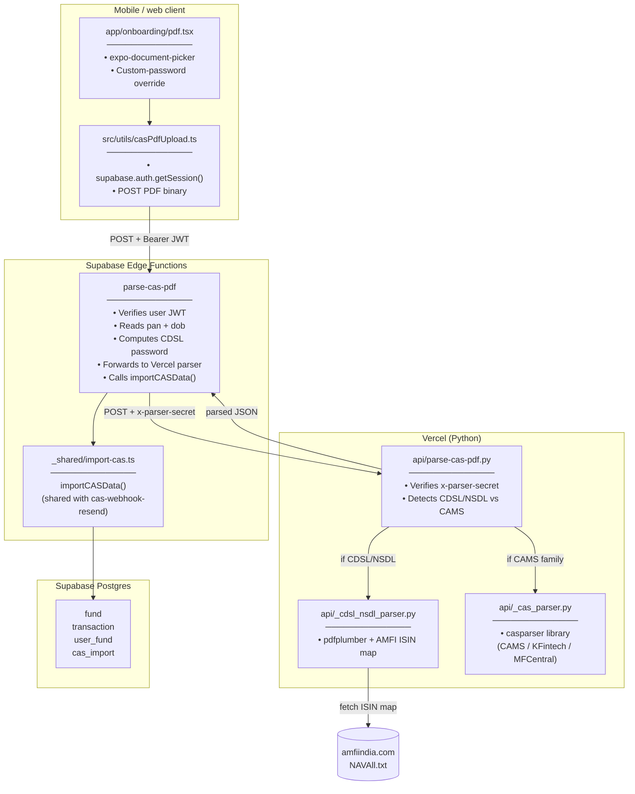
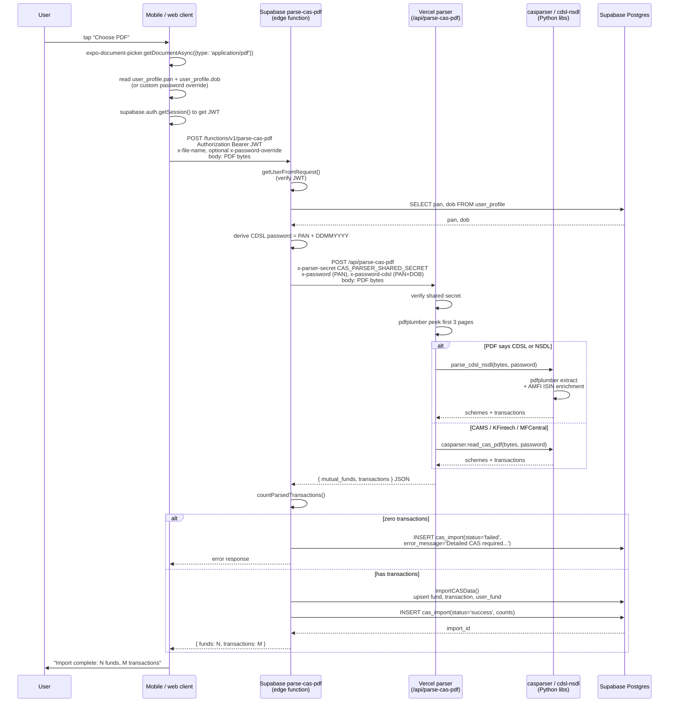

# CAS PDF Upload Flow

The "manual" CAS path — user picks a PDF in the wizard or settings and the import lands in the same `cas_import` audit row + `transaction` table the inbound (Resend) flow writes to. The two paths converge at `importCASData()`.

## Where things live

## Sequence

## Why two parser families

| Issuer | Library | Password format | Notes |
|---|---|---|---|
| CAMS, KFintech, MFCentral | `casparser` (Python lib by codereverser) | PAN | Mature, handles AMC-issued summary + Detailed CAS variants |
| CDSL / NSDL | In-house `_cdsl_nsdl_parser.py` | PAN + DDMMYYYY | Demat statements; `casparser` doesn't handle these reliably |

`api/parse-cas-pdf.py` peeks at the first 3 pages and dispatches based on which format markers it finds. Both branches return the same normalized `{ mutual_funds, transactions }` shape so the caller doesn't care which parser ran.

## How this differs from the inbound (Resend) flow

| Aspect | Upload flow | Inbound flow ([cas-inbound-flow.md](./cas-inbound-flow.md)) |
|---|---|---|
| Triggered by | User tap | CAMS/KFintech monthly email forwarded to inbox token |
| Auth boundary | User JWT (`getUserFromRequest`) | FolioLens HMAC (`FOLIOLENS_INBOUND_ROUTER_SECRET`) |
| User identity | From session | From `user_profile.cas_inbox_token` lookup |
| PDF source | Direct upload bytes in request body | Resend presigned `download_url` |
| Parser path | Same `/api/parse-cas-pdf` | Same |
| Import helper | Same `importCASData()` | Same |
| Notification email | None — UI shows result inline | Yes — via `/api/cas-import-notify` |
| Background processor | Not needed (sync, fast enough) | Yes (`EdgeRuntime.waitUntil`) — Resend has 15s Svix timeout |

The two paths converge at `supabase/functions/_shared/import-cas.ts:importCASData()`. Anything that affects schema mapping or transaction shaping happens once and benefits both paths.
