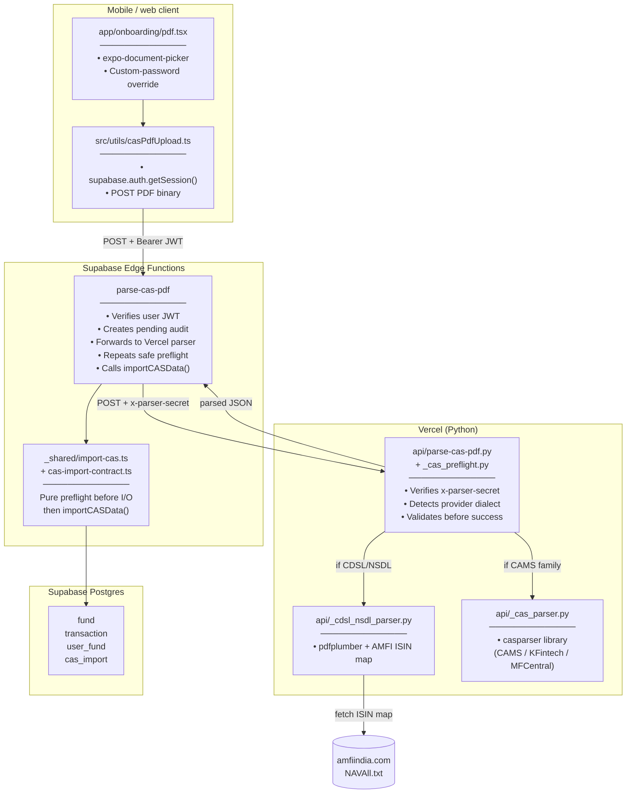
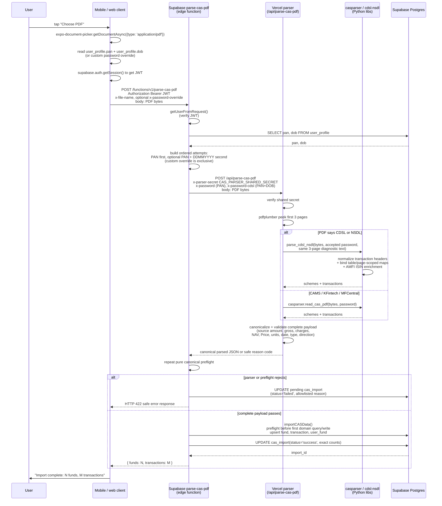

# CAS PDF Upload Flow

The "manual" CAS path — user picks a PDF in the wizard or settings and the import lands in the same `cas_import` audit row + `transaction` table the inbound (Resend) flow writes to. The two paths converge at `importCASData()`.

## Where things live

```mermaid
graph TB
  subgraph Client["Mobile / web client"]
    pdf_screen["app/onboarding/pdf.tsx<br/>──────────────<br/>• expo-document-picker<br/>• Custom-password override"]
    upload_util["src/utils/casPdfUpload.ts<br/>──────────────<br/>• supabase.auth.getSession()<br/>• POST PDF binary"]
  end

  subgraph SupabaseEdge["Supabase Edge Functions"]
    parse_edge["parse-cas-pdf<br/>──────────────<br/>• Verifies user JWT<br/>• Creates pending audit<br/>• Forwards to Vercel parser<br/>• Repeats safe preflight<br/>• Calls importCASData()"]
    shared["_shared/import-cas.ts<br/>+ cas-import-contract.ts<br/>──────────────<br/>Pure preflight before I/O<br/>then importCASData()"]
  end

  subgraph Vercel["Vercel (Python)"]
    parser["api/parse-cas-pdf.py<br/>+ _cas_preflight.py<br/>──────────────<br/>• Verifies x-parser-secret<br/>• Detects provider dialect<br/>• Validates before success"]
    cdsl["api/_cdsl_nsdl_parser.py<br/>──────────────<br/>• pdfplumber + AMFI ISIN map"]
    casparser["api/_cas_parser.py<br/>──────────────<br/>• casparser library<br/>(CAMS / KFintech / MFCentral)"]
  end

  subgraph SupabaseDb["Supabase Postgres"]
    db["fund<br/>transaction<br/>user_fund<br/>cas_import"]
  end

  pdf_screen --> upload_util
  upload_util -- "POST + Bearer JWT" --> parse_edge
  parse_edge -- "POST + x-parser-secret" --> parser
  parser -- "if CDSL/NSDL" --> cdsl
  parser -- "if CAMS family" --> casparser
  cdsl -- "fetch ISIN map" --> amfi[("amfiindia.com<br/>NAVAll.txt")]
  parser -- "parsed JSON" --> parse_edge
  parse_edge --> shared
  shared --> db
```

## Sequence

```mermaid
sequenceDiagram
  participant U as User
  participant App as Mobile / web client
  participant SB as Supabase parse-cas-pdf<br/>(edge function)
  participant V as Vercel parser<br/>(/api/parse-cas-pdf)
  participant Lib as casparser / cdsl-nsdl<br/>(Python libs)
  participant DB as Supabase Postgres

  U->>App: tap "Choose PDF"
  App->>App: expo-document-picker.getDocumentAsync({type: 'application/pdf'})
  App->>App: read user_profile.pan + user_profile.dob<br/>(or custom password override)
  App->>App: supabase.auth.getSession() to get JWT
  App->>SB: POST /functions/v1/parse-cas-pdf<br/>Authorization Bearer JWT<br/>x-file-name, optional x-password-override<br/>body: PDF bytes

  SB->>SB: getUserFromRequest()<br/>(verify JWT)
  SB->>DB: SELECT pan, dob FROM user_profile
  DB-->>SB: pan, dob
  SB->>SB: build ordered attempts:<br/>PAN first, optional PAN + DDMMYYYY second<br/>(custom override is exclusive)
  SB->>V: POST /api/parse-cas-pdf<br/>x-parser-secret CAS_PARSER_SHARED_SECRET<br/>x-password (PAN), x-password-cdsl (PAN+DOB)<br/>body: PDF bytes

  V->>V: verify shared secret
  V->>V: pdfplumber peek first 3 pages
  alt PDF says CDSL or NSDL
    V->>Lib: parse_cdsl_nsdl(bytes, accepted password,<br/>same 3-page diagnostic text)
    Lib->>Lib: normalize transaction headers<br/>+ bind table/page-scoped maps<br/>+ AMFI ISIN enrichment
    Lib-->>V: schemes + transactions
  else CAMS / KFintech / MFCentral
    V->>Lib: casparser.read_cas_pdf(bytes, password)
    Lib-->>V: schemes + transactions
  end
  V->>V: canonicalize + validate complete payload<br/>(source amount, gross, charges,<br/>NAV, Price, units, date, type, direction)
  V-->>SB: canonical parsed JSON or safe reason code

  SB->>SB: repeat pure canonical preflight
  alt parser or preflight rejects
    SB->>DB: UPDATE pending cas_import<br/>(status='failed', allowlisted reason)
    SB-->>App: HTTP 422 safe error response
  else complete payload passes
    SB->>DB: importCASData()<br/>preflight before first domain query/write<br/>upsert fund, transaction, user_fund
    SB->>DB: UPDATE cas_import(status='success', exact counts)
    DB-->>SB: import_id
    SB-->>App: { funds: N, transactions: M }
  end

  App->>U: "Import complete: N funds, M transactions"
```

## Why two parser families

| Issuer | Library | Password format | Notes |
|---|---|---|---|
| CAMS, KFintech, MFCentral | `casparser` (Python lib by codereverser) | PAN | Mature, handles AMC-issued summary + Detailed CAS variants |
| CDSL / NSDL | In-house `_cdsl_nsdl_parser.py` | PAN first; PAN + DDMMYYYY fallback when DOB is saved | Demat statements; a custom override is used exclusively |

`api/parse-cas-pdf.py` peeks at the first 3 pages and dispatches based on format markers. The same text reaches the depository adapter, so a marker on page two or three cannot make routing and parser diagnostics disagree. CDSL/NSDL issuer text is diagnostic only: every transaction table must provide an unambiguous normalized map for Date, Description, Amount, Units, and NAV or Price. Repeated headers and page breaks are supported; missing, duplicate, or ambiguous required headers return HTTP 422 with `unsupported_layout`. Stamp Duty and trailing charge columns are optional.

Both parser branches retain a provider dialect and the canonical financial fields until `_cas_preflight.py` validates the complete payload. `_shared/cas-import-contract.ts` repeats the same invariant checks before any shared-domain I/O. This defence in depth prevents an unsafe parser response from becoming an import write.

## How this differs from the inbound (Resend) flow

| Aspect | Upload flow | Inbound flow ([cas-inbound-flow.md](./cas-inbound-flow.md)) |
|---|---|---|
| Triggered by | User tap | CAMS/KFintech monthly email forwarded to inbox token |
| Auth boundary | User JWT (`getUserFromRequest`) | FolioLens HMAC (`FOLIOLENS_INBOUND_ROUTER_SECRET`) |
| User identity | From session | From `user_profile.cas_inbox_token` lookup |
| PDF source | Direct upload bytes in request body | Resend presigned `download_url` |
| Parser path | Same `/api/parse-cas-pdf` | Same |
| Import helper | Same `importCASData()` | Same |
| Notification email | None — UI shows result inline | Yes — via `/api/cas-import-notify` |
| Background processor | Not needed (sync, fast enough) | Yes (`EdgeRuntime.waitUntil`) — Resend has 15s Svix timeout |

The two paths converge at `supabase/functions/_shared/import-cas.ts:importCASData()`. A rejection may update only the already-created `cas_import` audit row to `failed`, using an allowlisted reason code and bucketed counts. No raw CAS payload, filename, identifier, amount, upstream response body, or exception text is persisted or emitted for diagnosis. Client `portfolio_imported` analytics also use bucketed fund and transaction counts.
