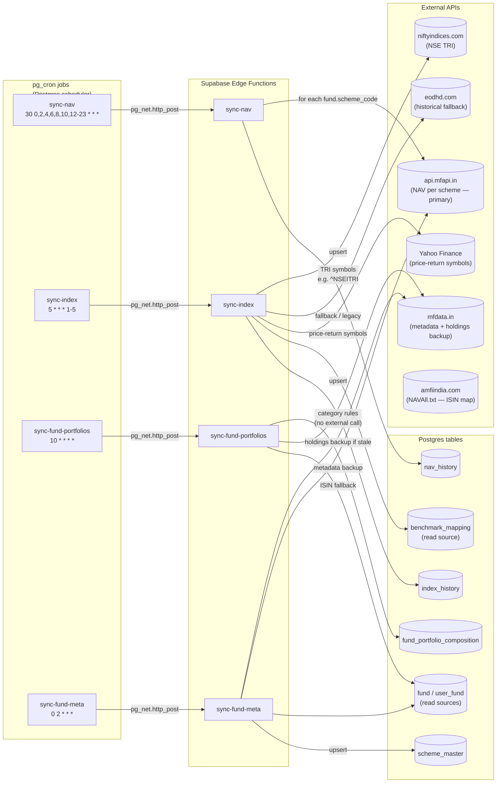
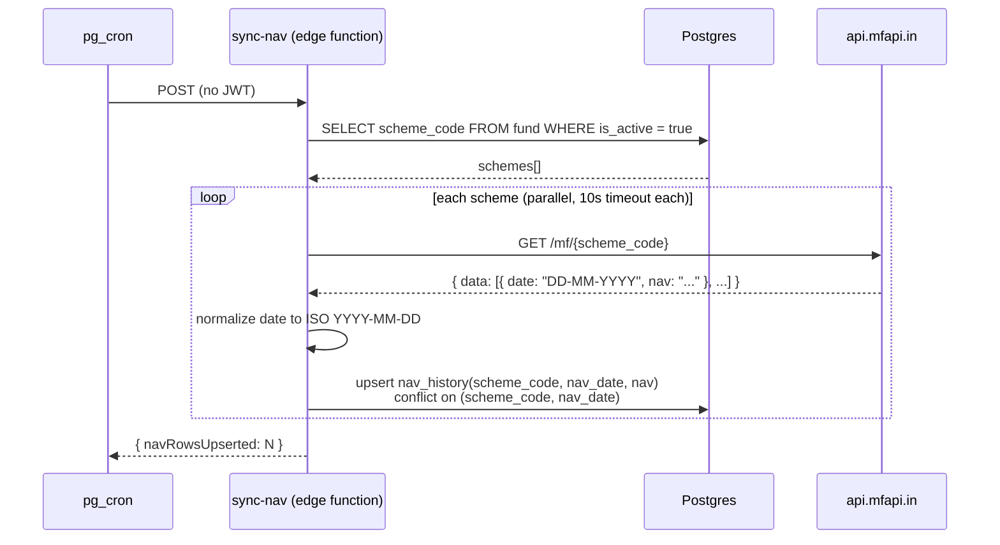
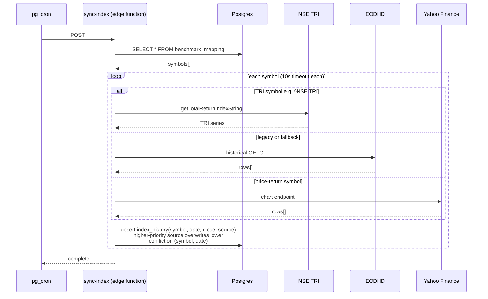
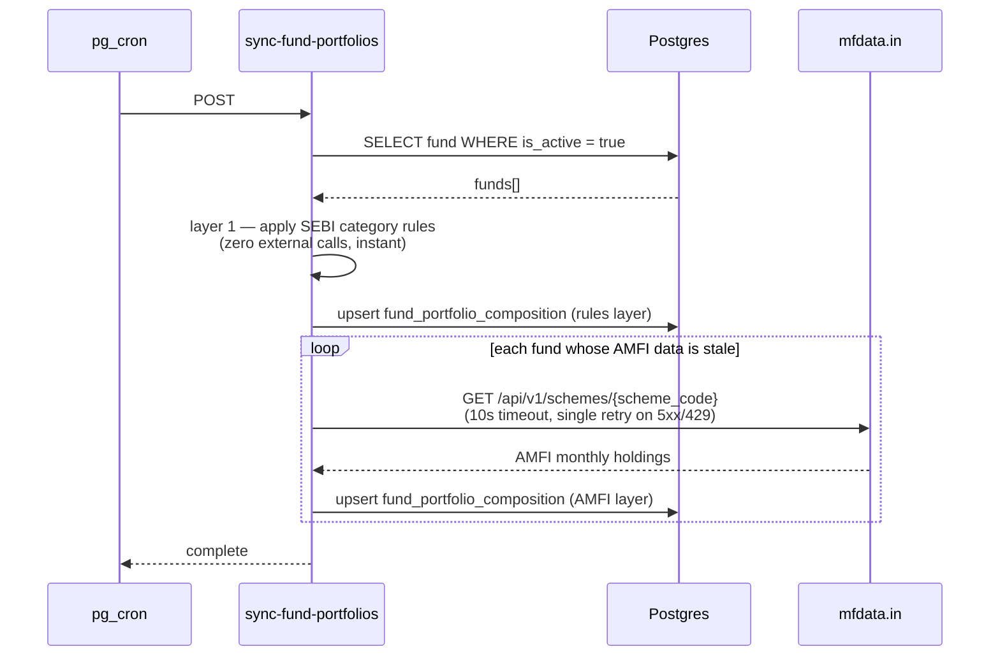
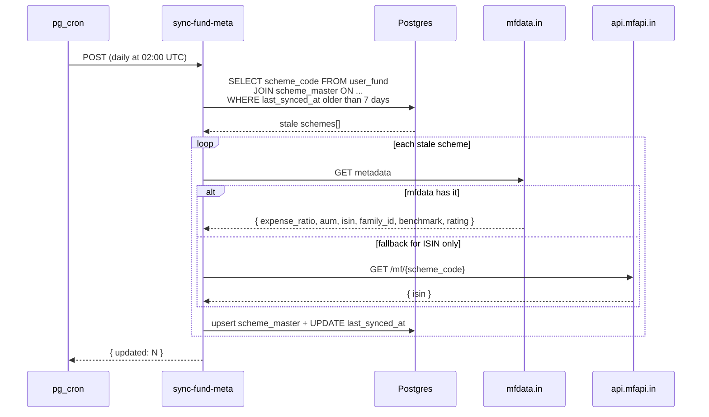

# Data Sync Pipeline — pg_cron + Edge Functions + External APIs

Edge functions on independent schedules keep prices, scheme metadata, fund composition, and benchmark indices fresh. All are triggered by `pg_cron` via `pg_net.http_post`, all are deployed with `--no-verify-jwt`, and all are idempotent (re-running is safe).

The `sync-stock-market-cap` edge function + monthly cron were **removed in 2026-06-01 (Phase 1)** and the `stock_market_cap` table was **dropped in 2026-06-08 (Phase 2)**. OpenFolio-Data now supplies the per-fund cap split directly via `source='official'` rows. The full deprecation plan is in [`docs/plans/deprecate-post-openfolio.md`](../plans/deprecate-post-openfolio.md).

## Where things live



## Schedules + dependency timing

```mermaid
gantt
  title One business-day timeline (UTC)
  dateFormat HH:mm
  axisFormat %H:%M

  section sync-nav (bimodal, 7 days)
  EOD window — hourly (12:30→00:30)      :a1a, 12:30, 5m
  Daytime — every 2h (02:30, 04:30, …)   :a1b, 02:30, 5m

  section sync-index (weekday)
  sync-index (every hour at :05)         :a2, 00:05, 5m

  section Hourly (always)
  sync-fund-portfolios (00:10 mark)      :a3, 00:10, 5m

  section Daily
  sync-fund-meta (02:00 UTC)             :a4, 02:00, 5m
```

`sync-nav` runs on a bimodal schedule — hourly during the EOD publish window (6 PM → 6 AM IST, i.e. 12:30 → 00:30 UTC) when AMCs actually push NAVs to mfapi, and every 2 hours during the daytime (8 AM → 5 PM IST, i.e. 02:30 → 10:30 UTC at even hours) to catch late corrections without burning compute on idle hours. Runs every day (not weekday-only) so a Friday-EOD NAV that lands Saturday morning IST gets picked up instead of waiting until Monday. Different AMCs land their NAVs at very different times — HDFC / ICICI / DSP typically hit mfapi within an hour of EOD, while PPFAS and international FoFs can take 4–6 hours longer; the dense EOD window catches both extremes.

`sync-index` still runs hourly weekday-only at `:05`. It no longer co-runs with `sync-nav` (which is at `:30`), but the home-screen NAV stamp + benchmark badge tolerate independent freshness — each is shown with its own "as of …" timestamp.

## sync-nav



Per-scheme failures don't block siblings. Re-runs are safe because of the conflict key.

## sync-index



Source priority enforces convergence: if NSE TRI succeeded for `(symbol, date)` later, a Yahoo run for the same row is skipped instead of clobbering it.

## sync-fund-portfolios



Two-layer write order matters: category rules go in *first* so the Insights UI never renders empty, even if every mfdata fetch fails this hour.

> **Note on `getCategoryRules()` caller contract:** if `scheme_category` is the bare single word `"Equity"` (DSP funds, half the ICICI Prudential lineup, etc.) the lookup falls to `GENERIC_CATEGORY_MAP['equity']`, a flexi-cap proxy (38/33/29). PR #188 added `deriveSchemeCategoryFromName()` to rescue the sub-bucket from the scheme name. **Any call to `getCategoryRules()` MUST pass `scheme_name` as the second argument** — without it the proxy bug silently returns a wrong cap split for any fund whose category is generic. See the [post-flexicap-proxy postmortem](../postmortems/2026-05-flexicap-proxy-strikes-twice.md).

## sync-fund-meta



`META_STALE_DAYS = 7` keeps mfdata.in calls cheap on most days — only schemes whose users joined recently or whose data aged out get re-pulled.

### period_returns blob — normalise at write, merge semantics

`scheme_master.period_returns` is written by two sources:

| Source | Keys written | Format |
|--------|-------------|--------|
| OpenFolio (sync-fund-meta OF path) | `ret_1y`, `ret_3y`, `ret_5y`, `ret_incep` | decimal CAGR (0.125) |
| mfdata backup (sync-fund-meta + fetch-fund-snapshot) | `ret_1m`, `ret_3m`, `ret_6m`, `ret_1y`, `ret_3y`, `ret_5y`, `ret_incep`, `rank_*`, `as_of_date` | decimal CAGR after normalisation (converted from mfdata's percent at write time) |

Both writers use helpers from `supabase/functions/_shared/period-returns.ts`:
- **`mergeMfdataReturns(mfdataBlob, existingBlob)`** — converts mfdata percent returns to decimal, then spreads the existing blob on top (existing values win). This preserves OF's precise values when mfdata runs after OF.
- **`mergeOfReturns(ofValues, existingBlob)`** — spreads existing blob first, then OF values on top (OF wins). This preserves mfdata's extra horizons (1m/3m/6m/ranks) when OF runs after mfdata.

**29 legacy mfdata-shape rows** (percent format, `return_1y` keys) exist on dev as of 2026-06-10. `readReturnPct` in `src/utils/mfdataGuards.ts` handles both shapes at read time and will continue to do so until all rows are refreshed by a cron run. This is `[cache-shape-stable]` — the client code returns identical percentage values regardless of which shape is stored.

## Why pg_cron + edge functions instead of GitHub Actions

- **Latency.** `pg_net.http_post` from inside Postgres to a Supabase Edge Function on the same project is ~10ms; a GH Actions cron + REST call would be 30-60s round trip.
- **Idempotency keys are tied to DB rows.** The `(scheme_code, nav_date)` conflict key is enforced inside the same transaction the read for `is_active = true` ran in. No skew window.
- **Auth.** Edge functions deployed with `--no-verify-jwt` don't need a service-role key in the cron job; the network boundary itself (Postgres → function over the Supabase internal network) is the auth boundary.

GitHub Actions cron is reserved for jobs that produce git artifacts ([.github/workflows/sync-amfi-portfolios.yml](../../.github/workflows/sync-amfi-portfolios.yml) — pulls AMFI's monthly disclosure CSVs into the repo for fund metadata regression-testing).

**Retired (2026-06-10):** `backfill-fund-universe.yml` + `scripts/backfill-fund-universe.mjs` — the pre-OpenFolio nightly workflow that pre-seeded the full ~37k AMFI universe with metadata, `source:'amfi'` composition rows, and full NAV history.  It was superseded by the `universe-backfill` Edge Function (OpenFolio composition + metadata for the full universe) and the on-pick `fetch-fund-nav` path (NAV history for non-held schemes).  The four workflow-state columns it tracked (`last_backfill_attempted_at`, `backfill_outcome`, `backfill_failure_count`, `is_inactive`) were dropped from `scheme_master` by migration `20260610000000`.  See [`docs/plans/deprecate-post-openfolio.md`](../plans/deprecate-post-openfolio.md) Phase 5 for the full rationale.
