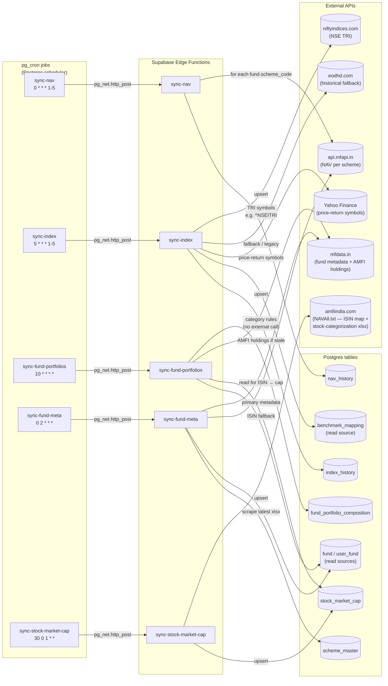
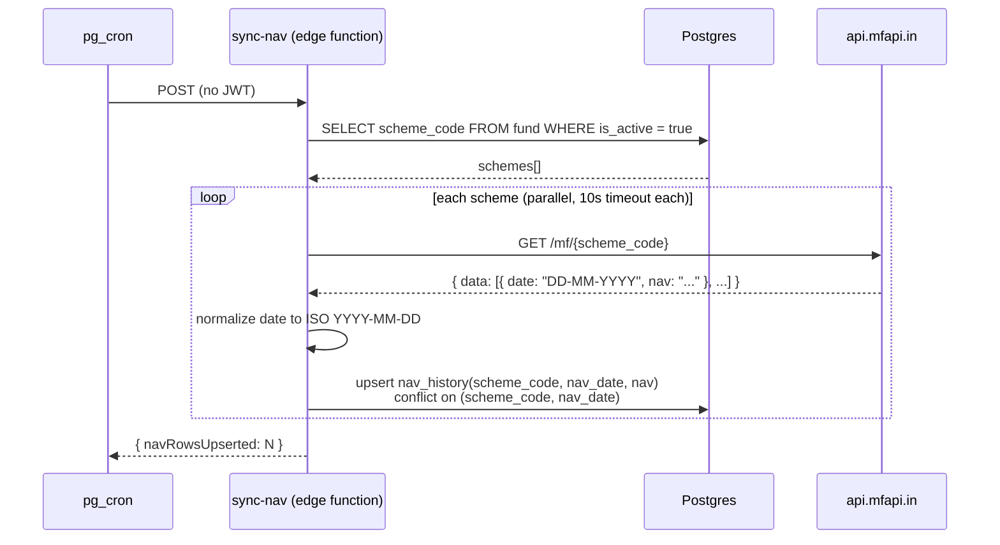
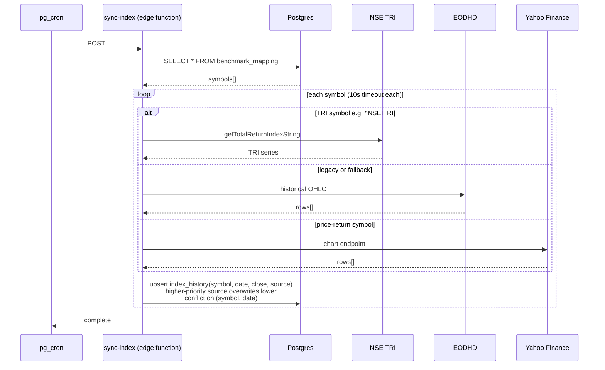
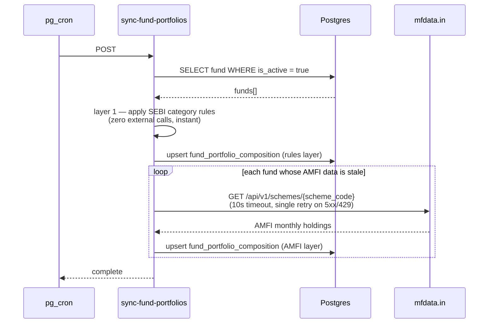
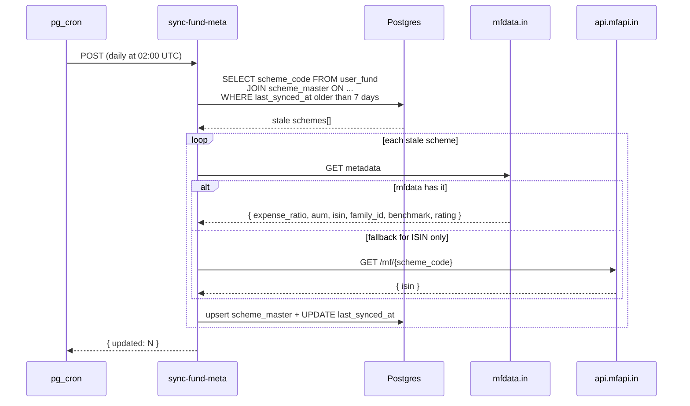
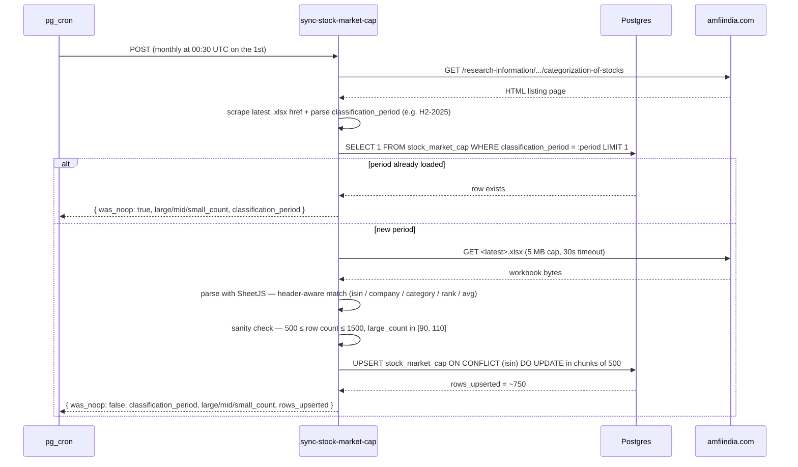

# Data Sync Pipeline — pg_cron + Edge Functions + External APIs

Five edge functions on independent schedules keep prices, scheme metadata, fund composition, benchmark indices, and the AMFI stock market-cap classification list fresh. All are triggered by `pg_cron` via `pg_net.http_post`, all are idempotent (re-running is safe), and most are deployed with `--no-verify-jwt`. `sync-stock-market-cap` is the exception — it's admin-only (`--verify-jwt`) since it changes a reference table that drives downstream classifications across every fund.

## Where things live

## Schedules + dependency timing

```mermaid
gantt
  title One business-day timeline (UTC)
  dateFormat HH:mm
  axisFormat %H:%M

  section Hourly (weekday)
  sync-nav (00:00 mark)                  :a1, 00:00, 5m
  sync-index (00:05 mark)                :a2, 00:05, 5m

  section Hourly (always)
  sync-fund-portfolios (00:10 mark)      :a3, 00:10, 5m

  section Daily
  sync-fund-meta (02:00 UTC)             :a4, 02:00, 5m
```

There's no explicit fan-out or wait — `sync-index` is scheduled 5 minutes after `sync-nav` so the home-screen "Live" badge has both fresh NAVs and fresh benchmark closes by the time it renders, but neither blocks the other.

`sync-stock-market-cap` runs on its own monthly track at 00:30 UTC on the 1st (not shown — its cadence is monthly, not daily). AMFI publishes the categorization list twice a year, so ~10 of 12 runs are no-ops; the monthly cadence keeps us resilient to AMFI shifting its publication window.

## sync-nav

Per-scheme failures don't block siblings. Re-runs are safe because of the conflict key.

## sync-index

Source priority enforces convergence: if NSE TRI succeeded for `(symbol, date)` later, a Yahoo run for the same row is skipped instead of clobbering it.

## sync-fund-portfolios

Two-layer write order matters: category rules go in *first* so the Insights UI never renders empty, even if every AMFI fetch fails this hour.

## sync-fund-meta

`META_STALE_DAYS = 7` keeps mfdata.in calls cheap on most days — only schemes whose users joined recently or whose data aged out get re-pulled.

## sync-stock-market-cap

The `stock_market_cap` table is the source of truth for the ISIN → market-cap lookup that `sync-fund-portfolios` and `fetch-fund-snapshot` join against. Without it, both portfolio builders fall back to SEBI category defaults (the `category_rules` source) — that fallback is correct behaviour (no real-holdings classification possible), but every Flexi Cap fund would carry the same 38/33/29 split, which is the bug Phase 9 M6 fixed.

The seeder is **idempotent** (precheck short-circuits before download when the period is already current) and **strictly additive** — it only ever upserts; rows are never deleted. A failed parse logs a typed `failure_reason` and the table keeps serving the previous period's data until a human fixes the parser.

Observability: every run emits `sync_completed` or `sync_failed` to PostHog with `large_count`, `mid_count`, `small_count`, and `was_noop`. Alert thresholds for the dashboard owner:

- `sync_failed` where `job = 'sync-stock-market-cap'` in last 7 days → page on-call (the seeder runs monthly).
- `large_count NOT BETWEEN 90 AND 110` → parser is reading the wrong column or sheet (Large bucket is consistently exactly 100 in AMFI lists).
- See `docs/plans/phase-9-pre-launch-readiness/M6-honest-portfolio-composition.md` Observability section for the full list including downstream classifier-coverage alerts on `sync-fund-portfolios` and `fund_snapshot_fetched`.

## Why pg_cron + edge functions instead of GitHub Actions

- **Latency.** `pg_net.http_post` from inside Postgres to a Supabase Edge Function on the same project is ~10ms; a GH Actions cron + REST call would be 30-60s round trip.
- **Idempotency keys are tied to DB rows.** The `(scheme_code, nav_date)` conflict key is enforced inside the same transaction the read for `is_active = true` ran in. No skew window.
- **Auth.** Edge functions deployed with `--no-verify-jwt` don't need a service-role key in the cron job; the network boundary itself (Postgres → function over the Supabase internal network) is the auth boundary.

GitHub Actions cron is reserved for jobs that produce git artifacts ([.github/workflows/sync-amfi-portfolios.yml](../../.github/workflows/sync-amfi-portfolios.yml) — pulls AMFI's monthly disclosure CSVs into the repo for fund metadata regression-testing).
