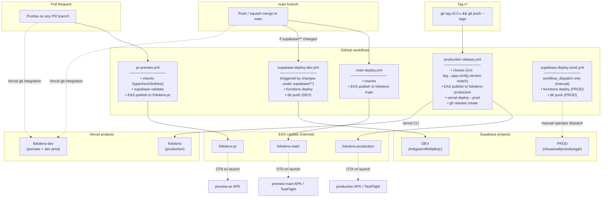
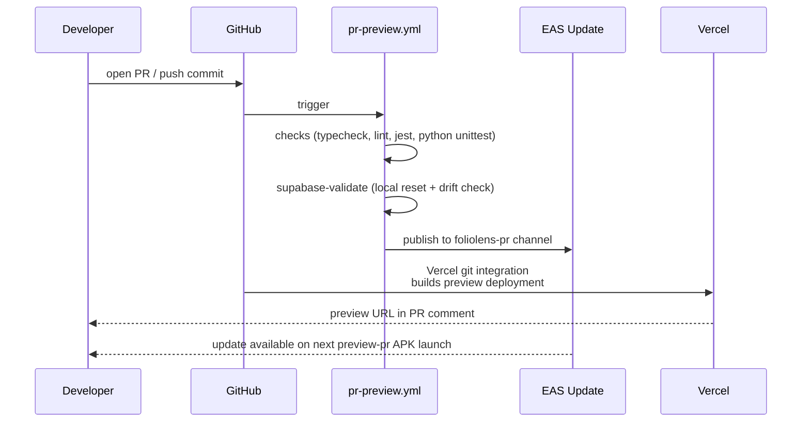
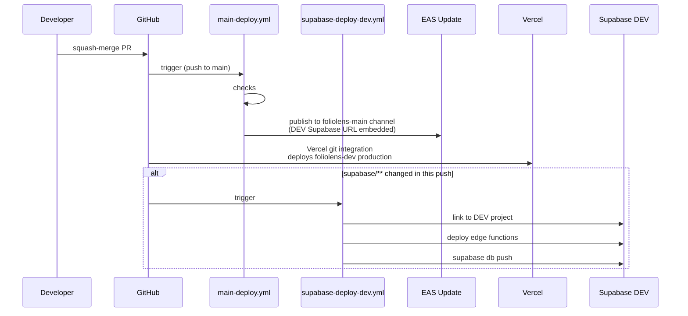
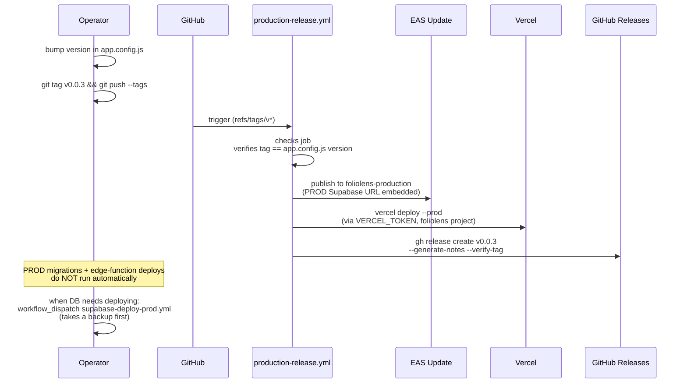

# Release Pipeline — PR / main / tag

Three GitHub-triggered workflows shape the release path. The contract:

- **Every PR** runs CI checks + publishes an EAS Update to the `foliolens-pr` channel + Vercel auto-creates a preview URL.
- **Every push to `main`** publishes an EAS Update to the `foliolens-main` channel (DEV Supabase) + Vercel auto-deploys `foliolens-dev`.
- **Production deploys are gated on a `v*` git tag.** Tagging triggers EAS publish to `foliolens-production` channel + Vercel CLI deploy to the prod project + a GitHub release.

Production database migrations and edge-function deploys are NOT automatic on tag — those run via `supabase-deploy-prod.yml` workflow_dispatch as a deliberate operator step.

## Surfaces

## Trigger sequences

### PR opened

### Merge to main

### Tag v\* (production release)

## Channel × profile × Supabase project

| Channel | Build profile | Supabase project | Vercel project | Notes |
|---|---|---|---|---|
| `foliolens-pr` | `preview-pr` | DEV | `foliolens-dev` (preview) | Internal APK distribution; per-PR preview URL |
| `foliolens-main` | `preview-main` | DEV | `foliolens-dev` (production) | Internal APK / TestFlight; tracks main branch |
| `foliolens-production` | `production` | PROD | `foliolens` (production) | TestFlight + Play Internal; tag-gated |

Three separate native binaries with distinct bundle IDs, schemes, and OAuth client IDs. `eas update` only ships JS — anything that changes native deps requires a new EAS build.

## Why production is tag-gated

Before this branching scheme was set up, every push to `main` auto-deployed the web app to production Vercel. Two real bugs in 2026 (one was the Phase 8 TRI cutover, one was the inbound webhook architecture) shipped to prod within minutes of merging because the gate was implicit ("don't merge until you're confident"). Tag-gating makes the gate explicit and the ship moment intentional. The `vX.Y.Z` tag now has to be:

1. Pushed deliberately
2. Match `app.config.js` version (the `verify-tag` step in `production-release.yml`)
3. Followed by a manual `supabase-deploy-prod.yml` dispatch if the release includes migrations (backed up beforehand)

If something needs to ship to prod without a tag (emergency hotfix), `production-release.yml` also accepts `workflow_dispatch` and the version-match check is skipped on dispatch runs.
